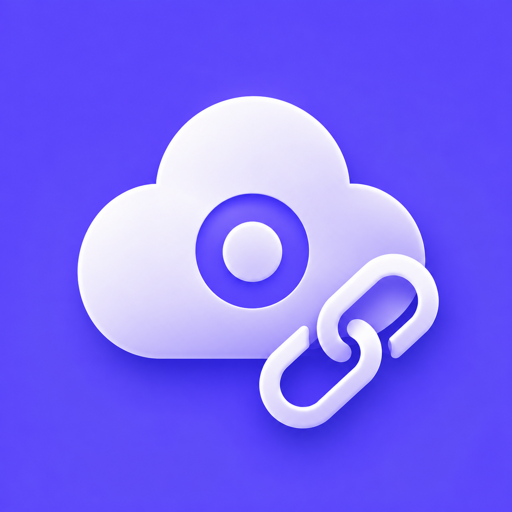
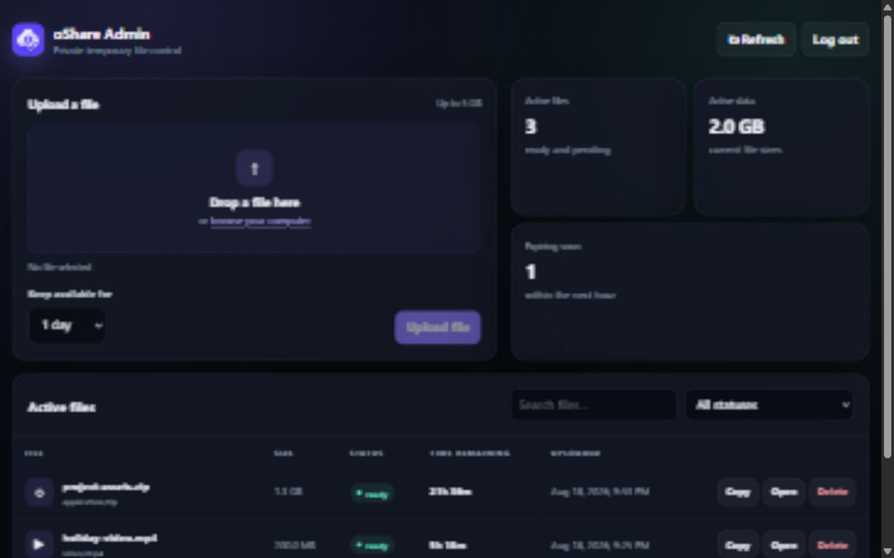
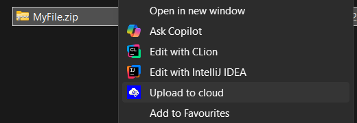
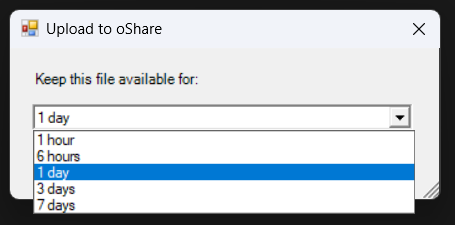
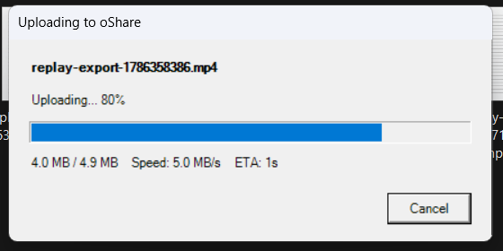
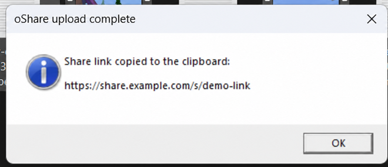

<p align="center">
  
</p>

<h1 align="center">oShare</h1>

<p align="center">
  Share large files from Windows, Android, or the web with links that expire automatically.
</p>

<p align="center">
  <a href="#features">Features</a> ·
  <a href="#getting-started">Getting started</a> ·
  <a href="docs/SETUP.md">Setup guide</a>
</p>

<p align="center">
  
</p>

## About

oShare is a personal, self-hosted file-sharing app for files that are too large for chat apps. Choose a file, decide how long it should stay available, and share the copied link.

You host it on your own AWS account and can use your own domain, name, and logo.

## Features

- Share files up to 5 GB
- Expiring links from 1 hour to 7 days
- Windows right-click upload
- Android share-sheet support
- Drag-and-drop web uploads
- Upload progress, speed, and ETA
- Automatic link copying
- Searchable admin dashboard
- View file type, size, upload time, and time remaining
- Copy, open, or delete any active share
- Custom domain and branding

## Use it anywhere

| Platform | Flow |
| --- | --- |
| **Windows** | Right-click a file → **Upload to cloud** → choose an expiry → share the copied link |
| **Android** | Tap **Share** on any file → choose oShare → choose an expiry → share the copied link |
| **Web** | Open the admin page → drop in a file → choose an expiry → copy the link |

## Windows upload flow

| Right-click a file | Choose an expiry |
| --- | --- |
|  |  |
| **Track the upload** | **Share the copied link** |
|  |  |

## Getting started

oShare is designed to run in your own AWS account.

```powershell
git clone https://github.com/oAnshull/oShare.git
Set-Location .\oShare\server
npm ci
Set-Location ..
sam build
sam deploy --guided
```

The guided deployment asks for your public URL, display name, admin password, and uploader secret.

Continue with the **[complete setup guide](docs/SETUP.md)** to connect a domain, install the Windows action, build the Android app, and apply your branding.

## Customization

Use any name and HTTPS domain you want. To replace the web, Android, and Windows logos together, run:

```powershell
.\scripts\set-logo.ps1 "C:\path\to\your-logo.png"
```

Android display name, package ID, version, and icon color are configured in `android/brand.properties`.

## Development

```powershell
Set-Location .\server
npm ci
npm run check
npm test

Set-Location ..
sam validate
sam build

Set-Location .\android
.\gradlew.bat assembleDebug
```

## Project structure

```text
android/          Android app and share target
desktop/          Windows right-click uploader
docs/             Setup guide and screenshots
scripts/          Branding helper
server/           API and web dashboard
template.yaml     AWS deployment template
```

## Contributing and security

Contributions are welcome; see [CONTRIBUTING.md](CONTRIBUTING.md). Report
security issues privately as described in [SECURITY.md](SECURITY.md).

## License

The code and bundled oShare artwork are available under the [MIT License](LICENSE).
See [THIRD_PARTY_NOTICES.md](THIRD_PARTY_NOTICES.md) for bundled tooling and
dependency license information.
