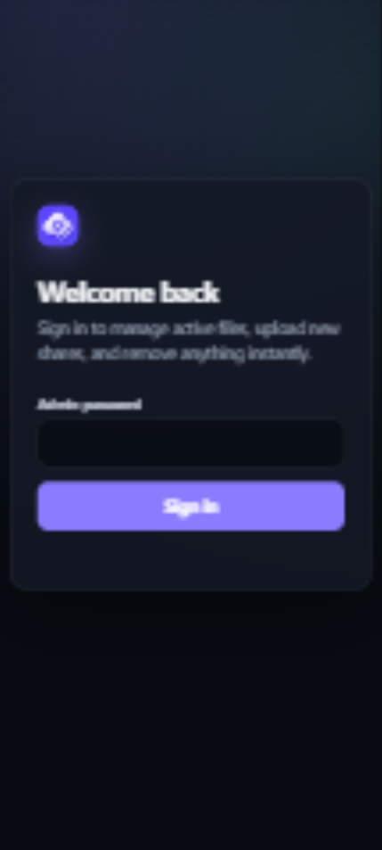
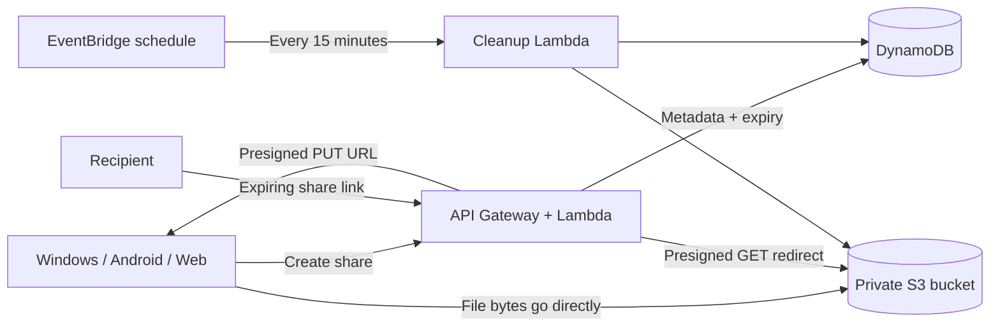

<p align="center">
  
</p>

<h1 align="center">oShare</h1>

<p align="center">
  Self-hosted, temporary file sharing from Windows, Android, or the web.
  Files stay private in your S3 bucket, links expire automatically, and the whole service runs in your AWS account.
</p>

<p align="center">
  
  
</p>

## What you get

- **Windows:** right-click any file, choose an expiry, watch progress/speed/ETA, and receive a copied link without a console window.
- **Android:** share a file to the app, choose an expiry, and upload directly from the Android share sheet.
- **Web admin:** upload files, search every active share, inspect size/type/time remaining, copy links, and delete files immediately.
- **Private storage:** S3 public access stays blocked. Recipients receive short-lived, signed download redirects.
- **Automatic expiry:** links stop resolving at their expiry time; a scheduled Lambda removes expired data every 15 minutes.
- **Large files:** direct single-request uploads up to 5 GB, so Lambda never proxies the file contents.
- **Portable branding:** configure the service URL, display name, Android application ID, app colors, and logo.

## How it works



The desktop and Android clients never contain AWS credentials. A trusted client authenticates to the API, receives one presigned S3 upload URL, sends the file directly to S3, and asks the API to verify the completed object.

## Prerequisites

- An AWS account and credentials allowed to deploy CloudFormation/SAM resources
- [AWS CLI](https://docs.aws.amazon.com/cli/latest/userguide/getting-started-install.html)
- [AWS SAM CLI](https://docs.aws.amazon.com/serverless-application-model/latest/developerguide/install-sam-cli.html)
- Node.js 22 or newer
- Windows PowerShell 5.1+ for the context-menu client
- JDK 17 and Android SDK 36 only if you want to build the Android app

## 1. Deploy the AWS service

Clone the repository and install the Lambda dependencies:

```powershell
git clone https://github.com/oAnshull/oShare.git
Set-Location .\oShare\server
npm ci
Set-Location ..
```

Build and start the guided deployment:

```powershell
sam build
sam deploy --guided
```

AWS recommends `sam deploy --guided` for a first deployment. It saves non-secret deployment choices in `samconfig.toml`; this project ignores that file because parameter overrides can include secrets. See the [official SAM deployment guide](https://docs.aws.amazon.com/serverless-application-model/latest/developerguide/using-sam-cli-deploy.html).

Use these parameter values when prompted:

| Parameter | Value |
| --- | --- |
| `UploadSecret` | A unique random secret of at least 16 characters. The Windows client uses it. |
| `AdminPassword` | A different strong password for the web admin panel. |
| `BrandName` | The name shown by the web interface, such as `oShare`. |
| `PublicBaseUrl` | Your final HTTPS domain, or the temporary API URL during initial testing. No trailing slash. |

Allow SAM to create IAM roles when prompted. The stack provisions:

- a private, encrypted S3 bucket;
- a DynamoDB metadata/expiry table;
- a REST API and Lambda API handler;
- a scheduled cleanup Lambda;
- least-privilege runtime roles for those functions.

After deployment, copy the `ApiUrl` stack output. If you do not have a custom domain yet, run the guided deployment again with that URL as `PublicBaseUrl`; generated links will then work on the default API Gateway address.

Future code updates use:

```powershell
sam build
sam deploy
```

## 2. Connect your domain

The service works on its generated API Gateway URL, but a custom subdomain such as `share.example.com` produces cleaner links.

1. Request an ACM certificate for your hostname in the same AWS Region as the API.
2. In API Gateway, create a **Regional** custom domain and attach that certificate.
3. Map the deployed REST API's `v1` stage to the domain root.
4. At your DNS provider, point the hostname to the Regional API Gateway target. Route 53 can use an alias record; third-party DNS providers can use a CNAME.
5. Redeploy with `PublicBaseUrl=https://share.example.com`.

AWS documents the complete flow in [Set up a Regional custom domain name](https://docs.aws.amazon.com/apigateway/latest/developerguide/apigateway-regional-api-custom-domain-create.html). The existing default API endpoint can remain enabled.

## 3. Install the Windows right-click client

Run this as your normal Windows user; administrator rights are not required:

```powershell
.\desktop\install.ps1 `
  -ApiBaseUrl "https://share.example.com" `
  -UploadSecret "the-same-value-used-for-UploadSecret" `
  -AppName "oShare" `
  -MenuLabel "Upload to cloud"
```

For a custom context-menu icon, pass an absolute `.ico` path with `-IconPath`. The installer writes the ignored `desktop/config.json` and registers one current-user shell action.

Remove it with:

```powershell
.\desktop\uninstall.ps1
```

## 4. Build the Android app

Copy the example configuration:

```powershell
Set-Location .\android
Copy-Item .\brand.properties.example .\brand.properties
```

Edit `brand.properties`:

```properties
serviceUrl=https://share.example.com
appName=oShare
applicationId=com.example.oshare
iconBackground=#584AF4
versionCode=1
versionName=1.0
```

`brand.properties` is ignored so each deployment can keep its own URL and package identity. Build a debug APK with:

```powershell
.\gradlew.bat assembleDebug
```

The APK is written to `android/app/build/outputs/apk/debug/app-debug.apk`.

### Signed release APK

Create and protect a long-lived signing key. Android updates must always use the same key.

```powershell
keytool -genkeypair -v `
  -keystore .\release-key.jks `
  -alias oshare `
  -keyalg RSA `
  -keysize 2048 `
  -validity 10000

Copy-Item .\keystore.properties.example .\keystore.properties
```

Fill in `keystore.properties`, then run:

```powershell
.\gradlew.bat assembleRelease
```

The keystore, signing configuration, and APKs are ignored by Git. Back up the keystore separately; losing it prevents in-place updates. See Android's [official app-signing guidance](https://developer.android.com/studio/publish/app-signing).

## Customize the name and logo

Branding is intentionally simple:

- **Web name:** set the SAM `BrandName` parameter.
- **Windows name:** pass `-AppName` and `-MenuLabel` to `desktop/install.ps1`.
- **Android name/ID/color:** edit ignored `android/brand.properties`.
- **Web + Android logo:** provide one square PNG to the helper:

```powershell
.\scripts\set-logo.ps1 "C:\path\to\your-logo.png"
```

The script updates both runtime logo assets. Rebuild/redeploy the server and rebuild Android afterward. A 1024×1024 or larger square PNG works best. The Android adaptive icon intentionally uses a small inset so launchers can apply their own masks without cutting off the artwork.

## Admin and sharing behavior

Open `<PublicBaseUrl>/admin` and sign in with `AdminPassword`. The session is stored in a signed, secure, HTTP-only cookie and expires after eight hours.

Available expiry choices are 1 hour, 6 hours, 1 day, 3 days, and 7 days. A link becomes invalid at the exact expiry timestamp; physical cleanup can occur up to roughly 15 minutes later. A bucket lifecycle rule is also included as an eight-day safety net.

The 5 GB limit is the maximum for a single S3 PUT. Supporting larger files requires multipart uploads and is intentionally outside this small personal-service design.

## Security notes

- Never commit `desktop/config.json`, `android/brand.properties`, `android/keystore.properties`, keystores, `samconfig.toml`, or AWS credential files.
- Use different values for `UploadSecret` and `AdminPassword`.
- Rotate `UploadSecret` by redeploying the stack and rerunning the Windows installer.
- S3 public access remains blocked; share downloads use short-lived presigned URLs.
- The Android app authenticates with the web admin session cookie and contains no upload secret or AWS key.
- AWS data-transfer charges are likely to dominate cost when recipients download large files.

## Project layout

```text
android/            Android WebView/share-target client
desktop/            Console-free Windows context-menu uploader
docs/screenshots/   README product screenshots
scripts/            Branding helper scripts
server/             Lambda API, admin UI, validation, and tests
template.yaml       Complete AWS SAM infrastructure
```

## Development checks

```powershell
Set-Location .\server
npm ci
npm run check
npm test

Set-Location ..
sam validate
sam build

Set-Location .\android
.\gradlew.bat assembleDebug
```

## Remove the AWS deployment

```powershell
sam delete
```

The S3 bucket and DynamoDB table use retention policies to prevent accidental data loss. After deleting the stack, remove those retained resources manually only if you are certain their data is no longer needed.
